# Loan Defaulter Analysis :hand: fa18-523-71 fa18-523-59

| Uma Kota, Jatinkumar Bhutka
| umabkota@iu.edu, jdbhutka@iu.edu
| Indiana University Bloomington
| hid: fa18-523-71 fa18-523-59
| github: [:cloud:](https://github.com/cloudmesh-community/fa18-523-71/edit/master/project-report/report.md)
| code: Project report only

## Abstract

Classifying loan defaulters from potential clients is one of the most important probelms in banking sector today. Especially, when there is little or no data regarding the customers\' credit history, it's difficult to predict whether the client will be able to repay their loan amount.In 2018, Home Credit , an international non-bank, consumer finance group released a variety of data in a kaggle competetion to urge the datascience enthusiasts all over the world to come up with new models and predictions. If an optimal solution is achieved, it would help us understand the clients potential of repaying the loan and also help many potential clients get their loans sanctioned .To classify the defaulters, we have tried various approaches including PCA and Random Forests for feature selection and Random Forest, k-nn and XGBOOST for modelling with XGBOOST giving us the best results. To build the models, Jupyter Notebook IDE with a python 3.7 kernel was used on the cloud computing service Microsoft Azure [@www-kagglehomecredit] .

---

### Keywords: fa18-523-71, fa18-523-59, Exploratory Data Analysis, Python, Jupyter Notebook, Microsoft Azure, Classification, Credit, K-NN, Random Forest, PCA, XGBOOST 

---

## Introduction
Defaulting is a case of inability of a debtor to meet the legal obligation of debt repayment on a loan or security when due just as in the case of a business where it fails to make coupon payments to his bondholders of issuing bonds. It has become increasingly important these days to manage the credit risk of the borrowers and hence see the revision of loan policies these days by many banking and financial institutions. To assess a borrower's credit risk, monitor borrower's behaviour are some of the key focus of interests in collecting the statistical data on the consumer's behaviour is concerned. This study, specifically helps the financial institutions examine the borrower's credit payment performance with respect to some of the variables. Banking and Financial institutions come up with some exogenous acceptance rule wih a view to investigate how a customer's payment performance will be, therby, ranking the potential customers according to the predicted default possibilities. The Related Research section gives a brief review of the ongoing and existing relevant research followed by models and predictions used to identify the potential clients of their ability to repay the loan.

## Related work 

One of the man studies on ameliorating the acceptance and the rejection criterion of the potential customers is 'investigates lenders and borrowers back in 1990 pertaining to the activities of consumer rationing for the United States' credit market. His investigation suggested of the rejections in loans due to the credit history, their age, income and the amount of collateral offered by the borrower to secure loan in case of delinquency. In due course of time, Crook (1996) replicated Jappelli's (1990) by saying more education for a household head would allow the potential borrower to be more capable in forecasting his loan repaying capability, thereby, leveraging the lender's thoughts on his decisions. With a view to measure the risk of portfolio for a sample loan, Roszbach K. and Jacobson T. (1998) built a statistical model with a view to provide a demo on the evaluation of the alternate lending policies and concluded that the decision on credit grant is not affected by the income. A little different to the above studies, the recent studies examine the effects of different variables on the customer’s payment performance characteristics.

## Data 

Home Credit released seven tables of data from different sources for this competition, but this project is confined to the main dataset which has features attributing to the loan, loan applicant and time of the loan. 

The main dataset has 307511 rows with each row representing individual loan application and 122 features (variables) including the TARGET which indicates if the loan is repaid (indicated by a 0) or not repaid (indicated by 1). For our project, we have taken the first 150000 rows for train and the next 30000 rows as the test dataset.

## Technologies used

## Exploratory Data Analysis 

The dataset with high dimensionality of 122 features required a series of univariate and bivariate anlayses to be conducted on it for us to understand the features and their relationship with each other.

* To begin with, we had to find the types of data the dataset comprises. We found out that of the 122 columns the dataset is made of 106 numeric and the rest of the 16 columns are categorical. Also, of the  106 numeric variables, 32 of them were Boolean.
* Number and percentage of missing values for each column were found to conduct missing value treatment on the dataset. 67 of the 122 columns had one or more missing values.
* The distribution of labels for the dependent variable,TARGET, was seen by plotting a countplot of the variable. It can be seen in the figure that the instances of repaid and not repaid are balanced. The instances where the customer has not repaid are very sparse making this problem a case of rare event modeling.

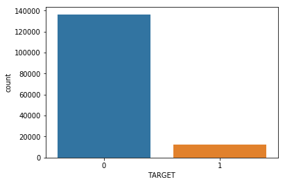 {#fig:LabelDistributionofTarget}

* Distributions of the intuitively important variables were also plotted to check for outliers and skewedness and it was found that many variables exhibited skewed distributions with outliers. In the figure +@fig:AMT_INCOME_TOTAL_dist, the histogram plot, shows the distribution of AMT\_INCOME\_TOTAL which captures total income of the applicant. In the figure +@fig:AMT_INCOME_TOTAL_outlier, the barplot shows the range of the feature and the outliers that lie outside the IQR (Inter Quartile Range) 

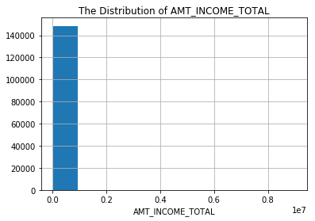 {#fig:AMT_INCOME_TOTAL_dist}

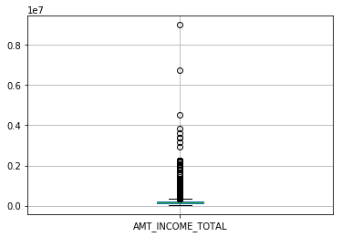 {#fig:AMT_INCOME_TOTAL_outlier}

Distribution of the categorical variable,OCCUPATION\_TYPE, can be seen in +@fig:OCCtypedist

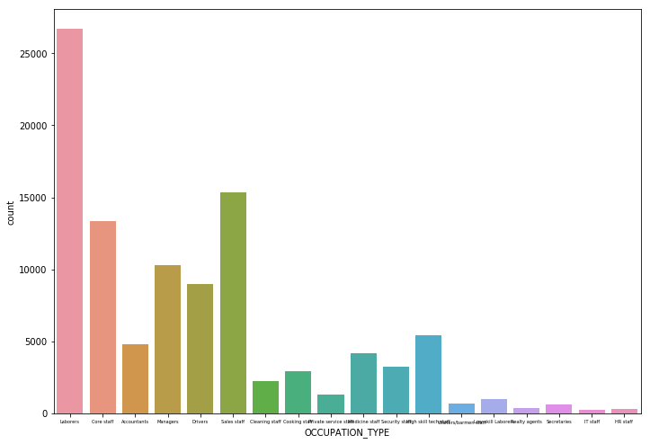 {#fig:OCCtypedist}

* Various bivariate analyses were also conducted to understand the relationship between the dependent and independent variables and relationships in between independent variables and to make sure no multi-collinearity exists in the dataset before we conduct statistical modeling. +@fig:extsource3target shows the variance of the EXT\_SOURCE3 variable with respect to the dependent variable and +@fig:occ_target_bivariate shows the same for the variable OCCUPATION\_TYPE

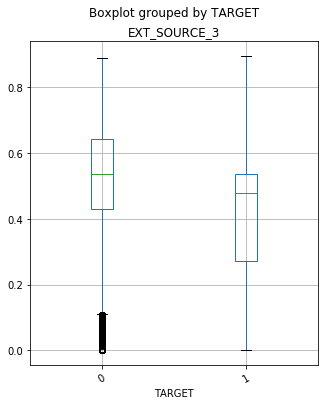 {#fig:extsource3target}

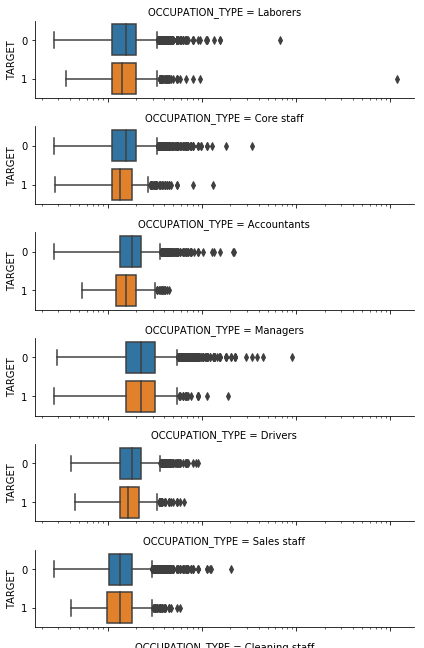 {#fig:occ_target_bivariate}

+@fig:occgender shows the relationship between gender, occupation type and income

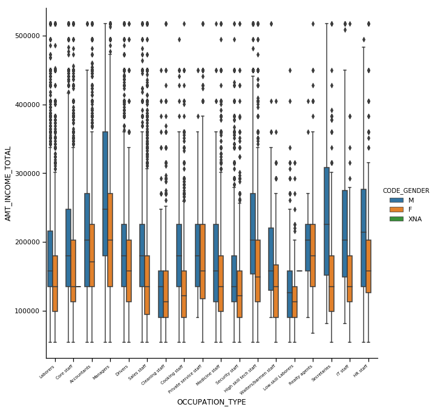 {#fig:occgender}

* Correalations between the variables were found before heading to feature selection.

## Feature Preprocessing

* Missing value treatment:
	* During the exploratory data analysis, it was found that 67 variables had one or more missing values.
	* For variables with less than one percent missing values, instances with missing values were removed from the dataset.
	* For variables with missing values between one and twenty percent, their missing values were replaced by the median value.
	* Apart from EXT\_SOURCE1, variables with more than thirty percent missing values were removed from the dataset as they didn't seem intuitive and replacing such high values of data would only skew the actual values.
	* While modeling for one of the XG-BOOST models, all the variables were considered irrespective of percentage of missing values as the model accepts missing values.
	
* Outlier treatment on selected numerical variables:
	* Outliers were found in most of the numerical columns and they may affect the model results
	* For selected columns, Winsorization was conducted. It's a clipping approach to make all the data stay between the first and ninety-ninth percentile [@www-winsorization-kdn]  . 

* One hot encoding:
	* As most machine learning algorithms cannot apprehend categorical variables, they have to be mapped to the number space.
	* One way of doing this is by representing the categorical variables as series of binary vectors.
	* Each vector represents a label, where 1 indicates its presence and 0 its absence [@www-onehot-encoding] .
	* This was achieved by using pandas.get\_dummies on all the categorical variables 

* Removing multi-collinearity:
	* The independent variables with a Pearson correlation of more than 0.9 were removed to curb redundancy in model.

* Scaling the data:
	* Using the Scikit-learn sklearn.preprocessing.MinMaxScaler module, the values were scaled such that they are all in between0 and 1  [@www-winsorization-kdn] .
	
## Feature Engineering
* New Features:
	* 3 new features, income\_fm,days\_emp and ann\_nr , were added to the list of features. They were calculated using the existing features. 

* Principal Component Analysis:
	* PCA is a procedure that changes potentially correlated variables into a smaller set of independent principal components.
	* The variability of dependent variable is mostly explained by the first component and as we proceed further, the variability explained decreases [@www-pca-ncsu] .
	* PCA was applied on the ten most intuitive features from the whole set.
	* The top 6 PCs were seen to explain most of the variability 
	
* Random Forest
	*  A Random forest classifier was trained on the train data and the importance of each variable was found using the model.
	*  Taking the importance scores into consideration, top 15 features were selected to make a model on
 
## Modeling Techniques 

### Random Forest

Random Forests is an ensemble technique that fits several decision tree classifiers on different subsets of dataset.Each tree votes for a specific class and the class with most number of votes is chosen, in this way it gives a better prediction  accuracy than a decision tree while simultaneously controlling over-fitting [@www-randomforest-model] [@www-rf-classifier] .

### K nn

KNN classifies a point based on feature similarity, i.e., by considering the classes k points around it belong to, It is a called a lazy learning algorithm as it requires no prior knowledge about the distribution of data and uses all the training data while classifying the test data [@www-knn-model] .

### XGBOOST

> XGBoost is an implementation of the Gradient Boosted Decision Trees algorithm. We go through cycles that repeatedly builds new models and combines them into an ensemble model [@www-xgboost-model] .

In every cycle, the errors in every observation are taken to build a new model on reducing them. The new predictions from such models are added to the ensemble of models  [@www-xgboost-model] .

### Model 1
Using the top 15 features given by scikit-learn's RFClassifier new test and train datasets are made. The new train dataset is used to fit a new Random Forest Classifier. When run on test, the classifier gave an accuracy score of 0.90 but when we look in to the confusion matrix we can see that the F1 score is very low (0.017) true positive cases in case of the loan defaulters

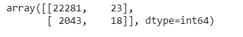 {#fig:m1ConfusionMatrix}

### Model 2
Using the new features created by PCA during feature analysis, another model is built by implementing 1-Nearest Neihbours (1 was chosen after tweaking for the best accuracy metrics), an f1 score of 0.13, although the model improved, the no. of true positive cases for loan defaulters was less.

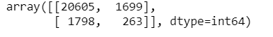 {#fig:m2ConfusionMatrix}

### Model 3
XGBOOST model was applied to the complete cleaned final dataset that had missing value treatment and outlier treatment done on it. With XGBOOST, while the accuracy dipped the f1 score improved with the number of true positive cases for the defaulter increasing  double fold 
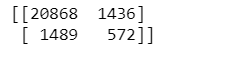 {#fig:m3ConfusionMatrix}

### Model 4
The final dataset was replaced by the dataset generated by PCA and XGBOOST was applied on the Principal Components. The accuracy and f1 score decreased with new dataset.

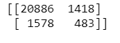 {#fig:m4ConfusionMatrix}

### Model 5
Another dataframe is created using the features that seem intuitive and XGBOOST is applied to the new dataset, a rise in accuracy and true positives of loan defaulters was observed.

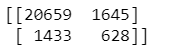 {#fig:m5ConfusionMatrix}

### Model 6
The dataset where no missingvalue and outlier treatment is conducted is taken and the top 15 features from RF are subsetted to become the new training set for the XGB model, this model resulted in an accuracy score of 0.88 and highest number of true positive cases of loa defaulters of all the 6 models

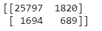 {#fig:m6ConfusionMatrix}

## Conclusion
Microsoft Azure as a cloud platform helps in running the jupyter notebooks on cloud anywhere and is works very robustly. The model 6 with XGBOOST trained on the dataset of the features with high importance according to Random Forest showed to give the best results out of the six models, The evaluation metric we considered for the selection of models was confusion matrix.

## Acknowledgment
We would like to thank professor Dr. Gregor von Laszewski for helping us with the problem statement and dataset selection and also for all the guidance he has provided us during the coursework. We would also like to thank the associate instructors for helping us and guiding us. 
